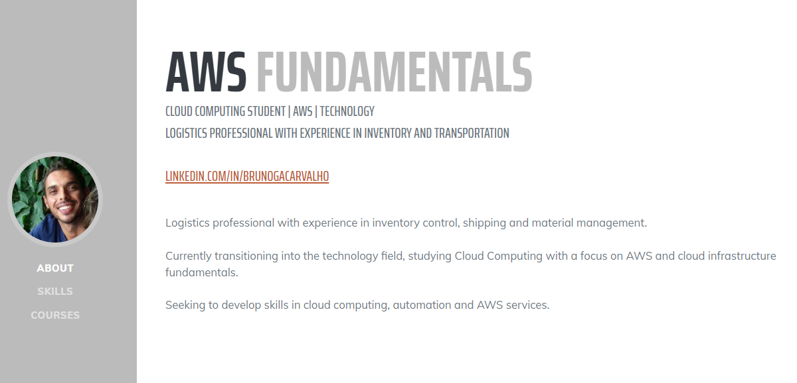

# Portfólio AWS Fundamentals

Este projeto foi desenvolvido durante o bootcamp GFT - Fundamentos de Cloud com AWS, realizado pela DIO. O objetivo deste portfólio é documentar meus estudos e atividades práticas relacionadas à Computação em Nuvem e aos fundamentos da AWS.

🌐 Demonstração Online: [Clique aqui](http://primeirobuckets3-121470661194-us-east-1-an.s3-website-us-east-1.amazonaws.com/)

## Preview

## Tópicos Estudados

- Introdução à AWS
- Infraestrutura Global da AWS
- Regiões e Zonas de Disponibilidade
- Usuários, Grupos e Permissões no IAM
- Configuração de MFA
- Monitoramento de Custos e Alertas de Cobrança
- AWS Console, CLI e CloudShell
- Fundamentos do EC2
- Amazon EBS
- Amazon S3

---

## Tecnologias Utilizadas

- HTML
- CSS
- Bootstrap
- AWS
- GitHub

---

## Objetivo do Projeto

Este projeto foi criado como parte da minha jornada de aprendizado em Cloud Computing e para praticar a criação e publicação de projetos utilizando GitHub.

---

## Autor

Bruno Carvalho  
LinkedIn: https://www.linkedin.com/in/brunogacarvalho/

## Créditos

Projeto desenvolvido durante o bootcamp [GFT](https://www.gft.com/br/pt) - Fundamentos de Cloud com AWS, realizado pela [DIO](https://dio.me).

Conteúdo e laboratório apresentados por [Alexsandro Lechner](https://linkedin.com/in/alexsandrolechner)  
GitHub: [@alexsandrolechner](https://github.com/alexsandrolechner)
